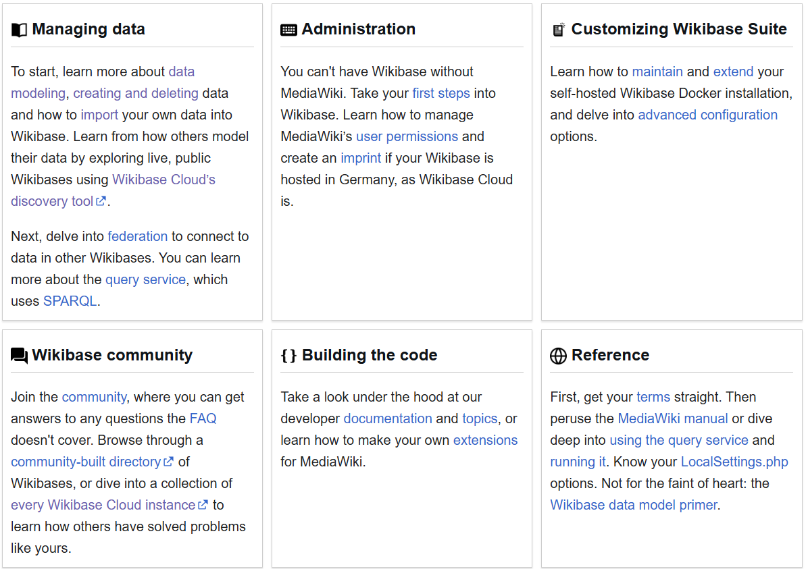
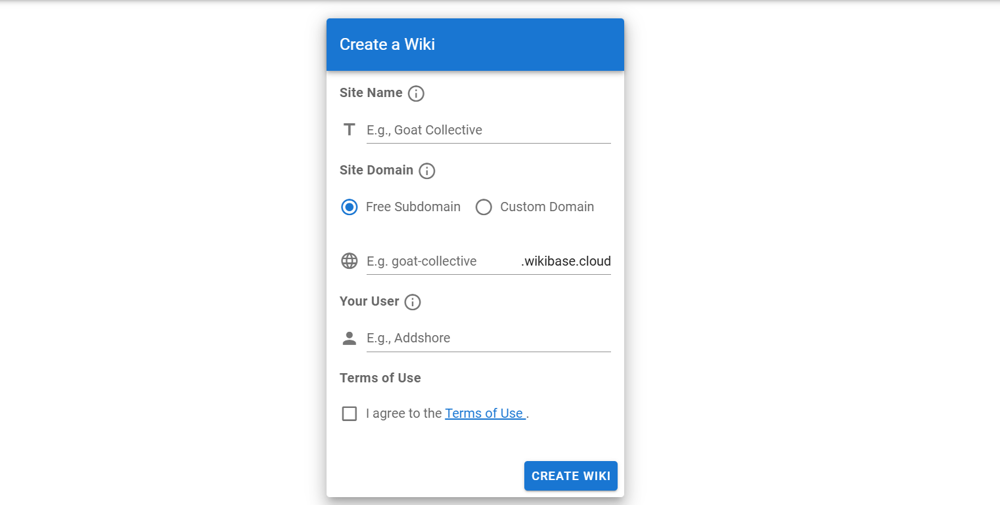
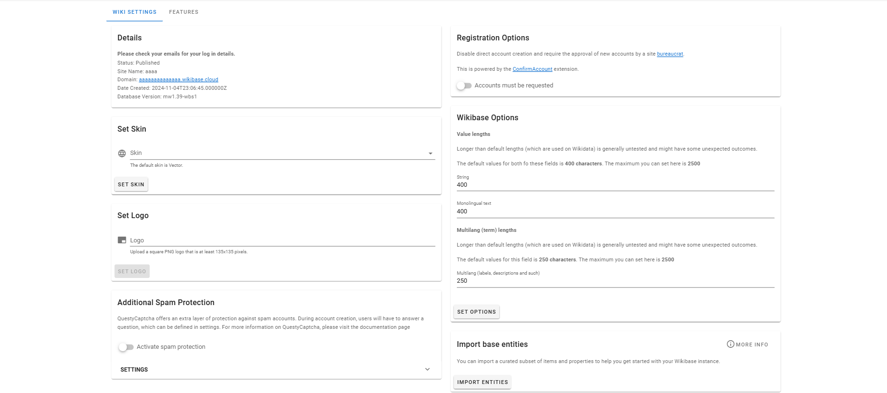
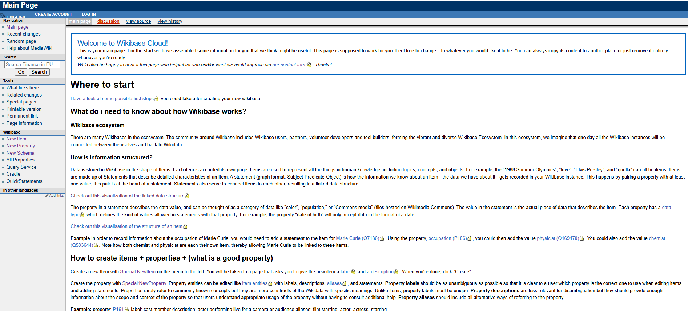

% WikiBase (+ Wikibase Cloud)

# What is WikiBase?

### Bullet points

- Wikibase is a free and open-source software suite
- Enables creation and management of open knowledge bases
- Maintained by Wikimedia Deutschland and a global community
- Suitable for institutions and research projects needing structured data

### How big is Wikidata?
More than 114,000,000 items created and managed by community effort

### Who edits Wikidata?
There are currently 24,526 active users

---

# Wikibase Examples

{ width=400px }

---

# WikiBase Infrastructure

{ width=350px }

---

# Data Modeling

- Modeling is a series of choices about how to organize your data, and those choices look different based on data
- Changing models may require significant data restructuring
- In Wikibase, you'll need to think of your data in terms of the concepts Wikibase uses to store data: **items, properties, statements**, and so forth.

{ width=280px }

---

# Different Modeling Options

More properties, or more items? 

{ width=200px } { width=200px }

---

# Data Creation

- **Need to import a large amount of data**
  - **OpenRefine** is for transforming and reconciling data for import
  - **WikibaseIntegrator** is a good choice if you know Python and want to automate data import

- **Need to keep external data in sync with Wikibase**
  - **OpenRefine** connects to various data stores, allowing for ongoing reconciliation with Wikibase

- **Want to input data manually with structured fields**
  - **Cradle** Ensures all required fields are filled when entering data manually

- **Need to import data from a flat text file**
  - **QuickStatements** accepts batch data in command formats (v1, CSV)

---

# Tool Overviews

- **OpenRefine** - a data-wrangling tool that connects to Wikibase and other databases. It allows transformation and mapping for import and ongoing reconciliation

- **WikibaseIntegrator** is a python library for automated data import. It is useful for creating bots to handle large imports with minimal intervention

- **Cradle** is useful for Wikibase administrators who wish to allow creation of lots of items manually, all of which need to conform to a particular schema.

---

# Tool Overviews

- **QuickStatements** supports v1 command format and CSV format.  Accessible via QuickStatements interface in Wikibase

{ width=300px }

{ width=280px }

---

## Wikibase Documentation and Creating a Wikibase

<url> https://www.wikibase.cloud/ </url>

Within Wikibase.cloud website you can register for creating Wikibases and find the documentation about data modelling, creating and deleting data, importing data, and many other things.

{ width=280px }

 
 
 
 

---

 
 
 

---

## **Choosing the name and the domain** 

 
 
 

---

## **Wikibase settings**

---

## Wikibase homepage
<url> https://finance-eu.wikibase.cloud/wiki/Main_Page </url>

